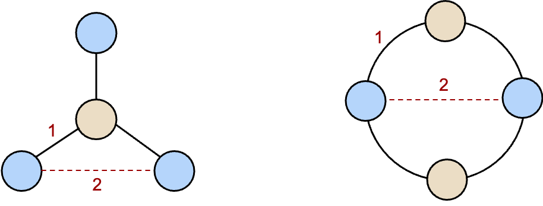

<div align=center>
    
</div>

English | [简体中文](README_CN.md) 

#### *NEWS!*
- [March 29] Our paper *[AMCAD: Adaptive Mixed-Curvature Representation based Advertisement Retrieval System](https://arxiv.org/abs/2203.14683)* has been accepted by ICDE'22!
- [November 03] The [Detailed explanation](https://mp.weixin.qq.com/s/uP_wU5nnd7faBoo5B_7Xfw?spm=ata.21736010.0.0.5b9d2c7eQ67WZg) is posted on Alimama Tech Blog!

## Why Non-Euclidean Geometry

Considering these simple graph structures shown below. Nodes with same color has 2-hop distance whereas 1-hop distance between nodes with different color. Now how could we embed these structures in Euclidean space while keeping these distance unchanged?

<div align=center>
    
</div>

Actually perfect embedding without distortion, appearing naturally in hyperbolic (negative curvature) or spherical (positive curvature) space, is infeasible in Euclidean space [[1](https://arxiv.org/abs/1911.05076)].

As shown above, due to the high capacity of modeling complex structured data, e.g. scale-free, hierarchical or cyclic, there has been an growing interest in building deep learning models under non-Euclidean geometry, e.g. link prediction [[2](https://arxiv.org/abs/1910.12933)], recommendation [[3](https://arxiv.org/abs/1809.01703)]. 

## What's CurvLearn

In this repository, we provide a framework, named ```CurvLearn```,  for training deep learning models in non-Euclidean spaces. 

The framework implements the non-Euclidean operations in Tensorflow and remains the similar interface style for developing deep learning models. 

Currently, ```CurvLearn``` serves for training several recommendation models in Alibaba. We implement ```CurvLearn``` on top of our distributed (graph/deep learning) training engines including [Euler](https://github.com/alibaba/euler) and [x-deeplearning](https://github.com/alibaba/x-deeplearning). The figure below shows how the category tree is embedded in hyperbolic space by using ```CurvLearn```.

<div align=center>
    
</div>


## Why CurvLearn

```CurvLearn``` has the following major features.

1. **Easy-to-Use**. Converting a Tensorflow model from Euclidean space to non-Euclidean spaces with ```CurvLearn``` is graceful and undemanding, due to the manifold operations are decoupled from model architecture and similar to vanilla Tensorflow operations. For researchers, ```CurvLearn``` also reserves lucid [interfaces](curvlearn/README.md) for developing novel manifolds and optimizers. 
2. **Comprehensive methods**. ```CurvLearn``` is the first Tensorflow based non-Euclidean deep learning framework and supports several typical non-Euclidean spaces, e.g. constant curvature and mixed-curvature manifolds, together with necessary manifold operations and optimizers.
3. **Verified by tremendous industrial traffic**. ```CurvLearn``` is serving on Alibaba's sponsored search platform with billions of online traffic in several key scenarios e.g. matching and cate prediction. Compared to Euclidean models, ```CurvLearn``` can bring more revenue and the RPM (revenue per mille) increases more than 1%.

Now we are working on exploring more non-Euclidean methods and integrating operations with Tensorflow. PR is welcomed!

## CurvLearn Architecture

<div align=center>
    
</div>


### Manifolds

We implemented several types of constant curvature manifolds and the mixed-curvature manifold.

- ```curvlearn.manifolds.Euclidean``` - Euclidean space with zero curvature.
- ```curvlearn.manifolds.Stereographic``` - Constant curvature stereographic projection model. The curvature can be positive, negative or zero.
- ```curvlearn.manifolds.PoincareBall``` - The stereographic projection of the Lorentz model with negative curvature.
- ```curvlearn.manifolds.ProjectedSphere``` - The stereographic projection of the sphere model with positive curvature.
- ```curvlearn.manifolds.Product``` - Mixed-curvature space consists of multiple manifolds with different curvatures.

### Operations

To build a non-Euclidean deep neural network, we implemented several basic neural network operations. Complex operations can be decomposed into basic operations explicitly or realized in tangent space implicitly.

- ```variable(t, c)``` - Defines a riemannian variable from manifold or tangent space at origin according to its name.
- ```to_manifold(t, c, base)``` - Converts a tensor ```t``` in the tangent space of ```base``` point to the manifold.
- ```to_tangent(t, c, base)``` - Converts a tensor ```t``` in the manifold to the tangent space of ```base``` point.
- ```weight_sum(tensor_list, a, c)``` - Computes the sum of tensor list ```tensor_list``` with weight list ```a```.
- ```mean(t, c, axis)``` - Computes the average of elements along ```axis``` dimension of a tensor ```t```.
- ```sum(t, c, axis)``` - Computes the sum of elements along ```axis``` dimension of a tensor ```t```.
- ```concat(tensor_list, c, axis)``` - Concatenates tensor list ```tensor_list``` along ```axis``` dimension.
- ```matmul(t, m, c)``` - Multiplies tensor ```t``` by euclidean matrix ```m```.
- ```add(x, y, c)``` - Adds tensor ```x``` and tensor ```y```.
- ```add_bias(t, b, c)``` - Adds a euclidean bias vector ```b``` to tensor ```t```.
- ```activation(t, c_in, c_out, act)``` - Computes the value of  activation function ```act``` for the input tensor ```t```.
- ```linear(t, in_dim, out_dim, c_in, c_out, act, scope)``` - Computes the linear transformation for the input tensor ```t```.
- ```distance(src, tar, c)``` - Computes the squared geodesic/distance between ```src``` and ```tar```.

### Optimizers

We also implemented several typical riemannian optimizers. Please refer to [[4](https://arxiv.org/abs/1810.00760)] for more details.

- ```curvlearn.optimizers.rsgd``` - Riemannian stochastic gradient optimizer.
- ```curvlearn.optimizers.radagrad``` - Riemannian Adagrad optimizer.
- ```curvlearn.optimizers.radam``` - Riemannian Adam optimizer.

## How to use CurvLearn

To get started with ```CurvLearn``` quickly, we provide a simple binary classification model as a quick start and three representative examples for the application demo.
Note that the non-Euclidean model is sensitive to the hyper-parameters such as learning rate, loss functions, optimizers, and initializers. It is necessary to tune those hyper-parameters when transferring to other datasets.

### Installation

```CurvLearn``` requires tensorflow~=1.15, compatible with both python 2/3.

The preferred way for installing is via `pip`. 

```bash
pip install curvlearn
```

### Quick Start

Here we show how to build binary classification model using ```CurvLearn```. Model includes ```Stereographic``` manifold, ```linear``` operations , ```radam``` optimizer, etc.

Instructions and implement details are shown in  [Quick Start](examples/quick_start.ipynb).

### HGCN on Link Prediction [[2](https://arxiv.org/abs/1910.12933)]

HGCN (Hyperbolic Graph Convolutional Neural Network) is the first inductive hyperbolic GCN that leverages 
both the expressiveness of GCNs and hyperbolic geometry to learn inductive node representations for hierarchical and scale-free graphs.
Run the command to check the accuracy on the OpenFlight airport dataset.
Running environment and performance are listed in [hgcn](examples/hgcn/README.md).

```python
python examples/hgcn/train.py
```

### HyperML on Recommendation Ranking [[3](https://arxiv.org/abs/1809.01703)]

HyperML (Hyperbolic Metric Learning) applies hyperbolic geometry to recommender systems through metric learning approach 
and achieves state-of-the-art performance on multiple benchmark datasets.
Run the command to check the accuracy on the Amazon Kindle-Store dataset. 
Running environment and performance are listed in [hyperml](examples/hyperml/README.md).

```python
python examples/hyperml/train.py
```

###  Hyper Tree Pre-train Model

In the real-world, data is often organized in tree-like structure or can be represented hierarchically.
It has been proven that hyperbolic deep neural networks have significant advantages over tree-data representation than Euclidean models.
In this case, we present a hyperbolic graph pre-train model for category tree in [Taobao](https://www.taobao.com/).
The further details including dataset description, model architecture and visualization of results can be found in [CateTreePretrain](examples/tree_pretrain/README.md).

```
python examples/tree_pretrain/run_model.py
```

## References

[1] Bachmann, Gregor, Gary Bécigneul, and Octavian Ganea. "Constant curvature graph convolutional networks." *International Conference on Machine Learning*. PMLR, 2020.

[2] Chami, Ines, et al. "Hyperbolic graph convolutional neural networks." *Advances in neural information processing systems* 32 (2019): 4868-4879.

[3] Vinh Tran, Lucas, et al. "Hyperml: A boosting metric learning approach in hyperbolic space for recommender systems." *Proceedings of the 13th International Conference on Web Search and Data Mining*. 2020.

[4] Bécigneul, Gary, and Octavian-Eugen Ganea. "Riemannian adaptive optimization methods." *arXiv preprint arXiv:1810.00760* (2018).

## License
This project is licensed under the Apache License, Version 2.0, unless otherwise explicitly stated.

