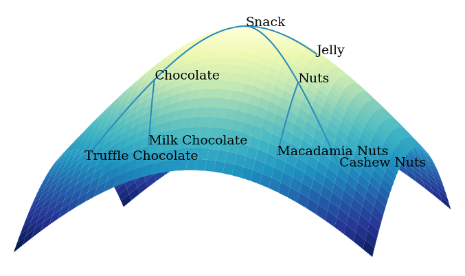

<div align=center>
    
</div>

[English](./README.md) | 简体中文 

#### *更新!*
- [04/16] 非欧最近邻检索工具[*CurvFaiss*](examples/curvfaiss/README.md)现已发布！
- [03/29] [*AMCAD: Adaptive Mixed-Curvature Representation based Advertisement Retrieval System*](https://arxiv.org/abs/2203.14683) 发表在ICDE'22！
- [11/03] [*曲率学习框架详解*](https://mp.weixin.qq.com/s/uP_wU5nnd7faBoo5B_7Xfw?spm=ata.21736010.0.0.5b9d2c7eQ67WZg) 发布在阿里妈妈技术公众号！


## 为什么使用非欧几何

考虑如下图展示的两种简单图结构，它们均满足同色节点间距为2跳距离而异色节点间距为1跳距离。现在我们考虑如何在欧氏空间中表征这些结构同时保持节点距离性质不变。

<div align=center>
    
</div>

实际上欧氏空间不可能无损表征上述树、环结构 [[1](https://arxiv.org/abs/1911.05076)]，然而这些结构天然的能被双曲（负曲率）、球面（正曲率）空间无损表征。

正如上图所展示的，由于对结构性强的数据如无尺度网络、层次数据、环状数据等的优良表征能力，非欧深度学习逐渐应用到各个领域并展示出优越性，包括链接预测 [[2](https://arxiv.org/abs/1910.12933)]、推荐系统 [[3](https://arxiv.org/abs/1809.01703)]等。

## 什么是CurvLearn

```CurvLearn``` 是一个开源的基于Tensorflow的非欧深度学习框架。

它实现了多种非欧流形、非欧算子和黎曼优化器，基于与Tensorflow相似的底层接口，用户可以便捷的迁移模型空间而不改变模型细节。

基于[Euler](https://github.com/alibaba/euler)和[x-deeplearning](https://github.com/alibaba/x-deeplearning)大规模深度学习图引擎，```CurvLearn``` 已经在阿里巴巴集团多种推荐模型中上线服务。下图展示了类目树被```CurvLearn``` 中双曲空间嵌入的结果。


<div align=center>
    
</div>

## 为什么使用CurvLearn

目前```CurvLearn``` 具备如下特性：
1. **易于使用。** 由于模型空间与模型结构几乎正交，基于```CurvLearn```，模型可以便捷的迁移到非欧空间，同时向下兼容原始欧氏模型。此外```CurvLearn``` 还预留了简明的[接口](curvlearn/README.md)来便于学者探索开发新的非欧流形、黎曼优化器等。
2. **丰富的流形与算子。** ```CurvLearn``` 是首个基于Tensorflow的非欧深度学习框架，它支持多种典型的经过验证的非欧流形，如常曲率流形，积流形等，同时包括丰富的构建神经网络所需的算子与优化器。
3. **大规模工业场景验证。** ```CurvLearn``` 目前服务于阿里巴巴百亿数据量级的搜索广告平台，包括召回和类目预测场景。相比于欧氏模型，```CurvLearn``` 带来了超过1%的千次展现收入（RPM）提升。

目前我们致力于探索开发新的非欧表征方法及更好的与Tensorflow集成，欢迎PR！

## CurvLearn 架构

<div align=center>
    
</div>

### 流形

框架支持以下常曲率流形和混合曲率流形：

- ```curvlearn.manifolds.Euclidean``` - 欧几里得空间，曲率恒零。
- ```curvlearn.manifolds.Stereographic``` - 使用球极平面投影的常曲率空间，曲率可以是任意实数值。
- ```curvlearn.manifolds.PoincareBall``` - 双曲几何中的庞加莱球模型，曲率恒负。
- ```curvlearn.manifolds.ProjectedSphere``` - 球面几何中的球极平面投影模型，曲率恒正。
- ```curvlearn.manifolds.Product``` - 多种流形笛卡尔积构成的积流形，曲率具备各向异性。

### 算子

为了便于构建深度神经网络模型，框架实现了以下基本算子。复杂算子可以显式的通过基本算子组合构建，也可以利用切空间隐式的构建。

- ```variable(t, c)``` - 定义黎曼向量，根据其名称约定构建方式：流形/原点切空间。
- ```to_manifold(t, c, base)``` - 将处于```base```点切空间中的向量 ```t``` 投影到流形上。
- ```to_tangent(t, c, base)``` - 将黎曼向量 ```t``` 投影到 ```base``` 点的切空间中。
- ```weight_sum(tensor_list, a, c)``` - 根据权重列表```a```，计算黎曼向量列表 ```tensor_list```的带权和。
- ```mean_aggr(t, c, axis)``` - 计算黎曼向量```t```沿```axis```维度的平均。
- ```sum_aggr(t, c, axis)``` - 计算黎曼向量```t```沿```axis```维度的和。
- ```concat(tensor_list, c, axis)``` - 将黎曼向量列表 ```tensor_list```沿```axis```维度进行拼接。
- ```matmul(t, m, c)``` - 计算黎曼向量 ```t```与欧氏矩阵 ```m```的乘法。
- ```add(x, y, c)``` - 计算黎曼向量 ```x``` 与黎曼向量 ```y```的加法。
- ```add_bias(t, b, c)``` - 计算黎曼向量 ```t```与欧氏向量 ```b```的加法。
- ```activation(t, c_in, c_out, act)``` - 计算黎曼向量 ```t```经过激活函数```act```的值。
- ```linear(t, in_dim, out_dim, c_in, c_out, act, scope)``` - 计算黎曼向量```t```经过线性变换后的值。
- ```distance(src, tar, c)``` - 计算黎曼向量```src```和黎曼向量```tar```的平方距离。

### 黎曼优化器

框架实现了以下黎曼优化器，相关细节参考 [[4](https://arxiv.org/abs/1810.00760)]。

- ```curvlearn.optimizers.rsgd``` - 黎曼SGD优化器，欧氏空间下退化为SGD。
- ```curvlearn.optimizers.radagrad``` - 黎曼Adagrad优化器，欧氏空间下退化为Adagrad。
- ```curvlearn.optimizers.radam``` - 黎曼Adam优化器，欧氏空间下退化为Adam。

## 如何使用CurvLearn

为了快速入门```CurvLearn```，我们构建了二分类模型示例用作快速开始，同时给出了三个代表性的例子作为真实场景下的应用展示。

值得指出的是非欧模型往往对诸如学习率、损失函数、优化器、初始化等超参数十分敏感，当迁移到新的数据集时有必要调整参数。

### 安装

```CurvLearn``` 依赖于Tensorflow~=1.15, 与python 2/3同时保持兼容。

推荐使用```pip```进行安装配置。

```bash
pip install curvlearn
```

### 快速开始

这里我们展示了如何利用```CurvLearn```构建简单二分类模型，包括使用```Stereographic``` 流形，```linear``` 算子，```radam``` 优化器。

文档指引及代码细节参考 [Quick Start](examples/quick_start.ipynb)。

### 链接预测（HGCN）[[2](https://arxiv.org/abs/1910.12933)]

HGCN结合了双曲空间与图神经网络，在层次数据与无尺度网络数据上表现优异。

执行以下命令使得模型在OpenFlight airport 数据集上进行训练与评测。
运行环境与模型表现参考 [hgcn](examples/hgcn/README.md)。

```python
python examples/hgcn/train.py
```

### 推荐系统（HyperML）[[3](https://arxiv.org/abs/1809.01703)]

HyperML (Hyperbolic Metric Learning) 结合了双曲空间与度量学习，在多个任务上取得了最优结果。 

执行以下命令使得模型在Amazon Kindle-Store数据集上进行训练与评测。
运行环境与模型表现参考 [hyperml](examples/hyperml/README.md)。

```python
python examples/hyperml/train.py
```

###  向量预训练（CateTreePretrain)

现实世界中数据往往展现为树状结构或者能被层次化的构建（如幂律分布）。

基于双曲空间对树状数据的优异表征能力，我们对[淘宝](https://www.taobao.com/)的树状类目数据进行了双曲预训练，执行以下命令进行模型训练。

数据集构建、模型结构及可视化结果等细节参考 [CateTreePretrain](examples/tree_pretrain/README.md)。

```python
python examples/tree_pretrain/run_model.py
```

## 参考文献

[1] Nickel M, Kiela D. Poincaré embeddings for learning hierarchical representations[J]. Advances in neural information processing systems, 2017, 30: 6338-6347.

[2] Ganea O E, Bécigneul G, Hofmann T. Hyperbolic neural networks[J]. arXiv preprint arXiv:1805.09112, 2018.

[3] Chami I, Ying Z, Ré C, et al. Hyperbolic graph convolutional neural networks[J]. Advances in neural information processing systems, 2019, 32: 4868-4879.

[4] Vinh Tran L, Tay Y, Zhang S, et al. Hyperml: A boosting metric learning approach in hyperbolic space for recommender systems[C]//Proceedings of the 13th International Conference on Web Search and Data Mining. 2020: 609-617.

[5] Bécigneul G, Ganea O E. Riemannian adaptive optimization methods[J]. arXiv preprint arXiv:1810.00760, 2018.

## License

This project is licensed under the Apache License, Version 2.0, unless otherwise explicitly stated.

