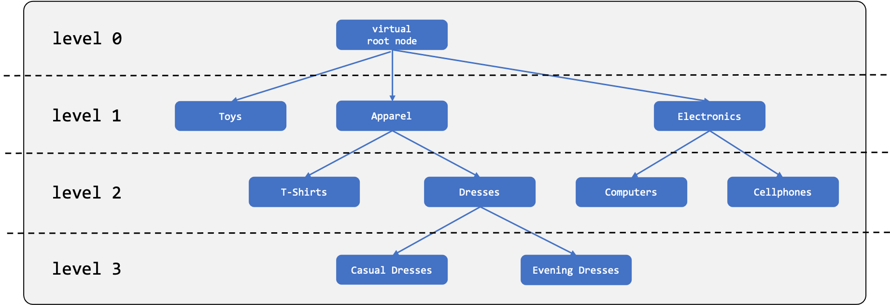
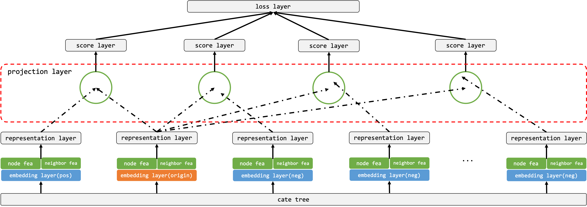
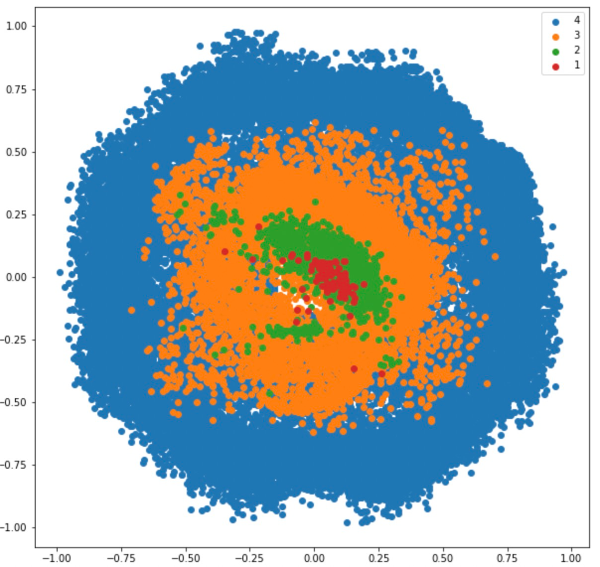
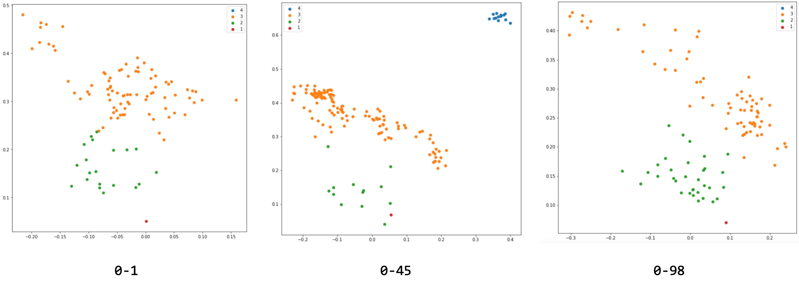

# Example of Tree-Pretrian using curvlearn

In this example, we implement category tree pre-train model by curvlearn.

## Dataset
Category tree is an organization of categories in tree-structure, including a virtual root node and several category nodes.

<div align=center>
    
</div>

We use randomly generated category tree, 4 levels and 80857 nodes are kept in the dataset(excluding virtual root node).

cate | cate_id | parent_cate | parent_cate_id | level
---- | --- | --- | --- | ---
0-3 | 7942 | 0 | 80815 | 1
0-12-34 | 28364 | 0-12 | 69473 | 2
0-98-7-12-6 | 14376 |  0-98-7-12 | 24865 | 4

where `cate` and `parent_cate` are expressed as cate index path(`-` denotes the HAS-A relation in category tree), `0` represents virtual root node. `cate_id` and `parent_cate_id` are random-indexed category, starting at 0 and increase by 1.

## Model
This picture outlines the overall architecture of our proposed model.

<div align=center>
    
</div>

This network has two parts with shared parameters, the positive part and the negative part. Since we optimize for a pairwise triplet loss, the model takes in a positive category and a couple of negative categories, and aims to maximize the margin between the scores of the correct pair and the wrong pair. 

The projection layer shows the distance relations among the positive pair and negative pairs in hyperbolic space.

## Result
This picture shows a visualization of all category embeddings projected to 2 dimensions after 10000 epochs, the numbers in the legend respectively represent the corresponding category level.

<div align=center>
    
</div>

In the meantime, we also give visualizations of the nodes under `0-1`, `0-45` and `0-98`.

<div align=center>
    
</div>

We observe that categories located quite high up in the hierarchy have relatively low vector norms and distribute at the center of hyperbolic space.

## Run
Launch the training by
```
python examples/tree_pretrain/run_model.py
```

The code has been tested under the following environment settings:
```
Hardware:
Tesla P100 - 16GB (Actual consumption: 1.4GB)
Intel Xeon E5-2682 v4 @ 2.50GHz

Python dependencies:
tensorflow-gpu==1.15.0
euler==2.0
numpy==1.16.5
```

